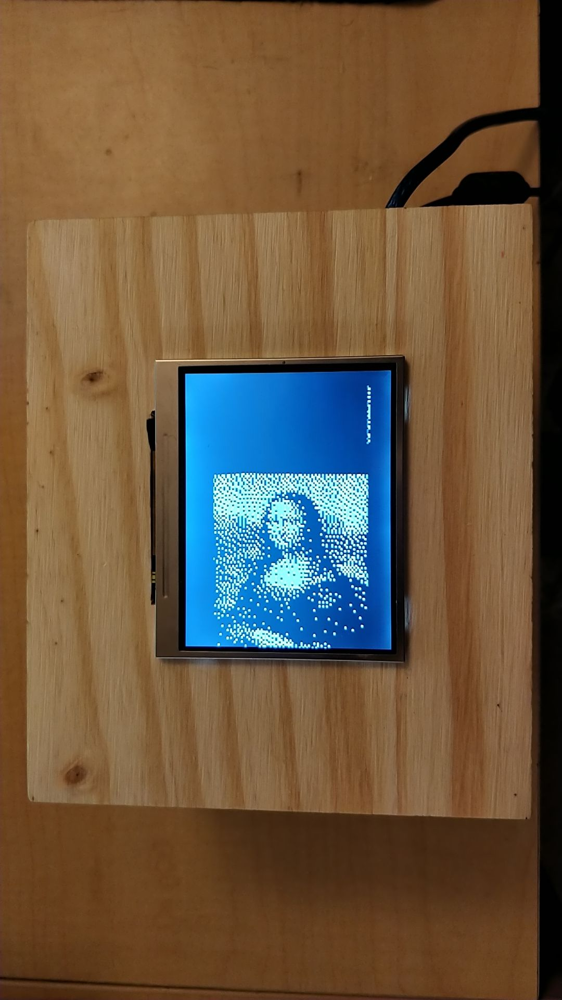
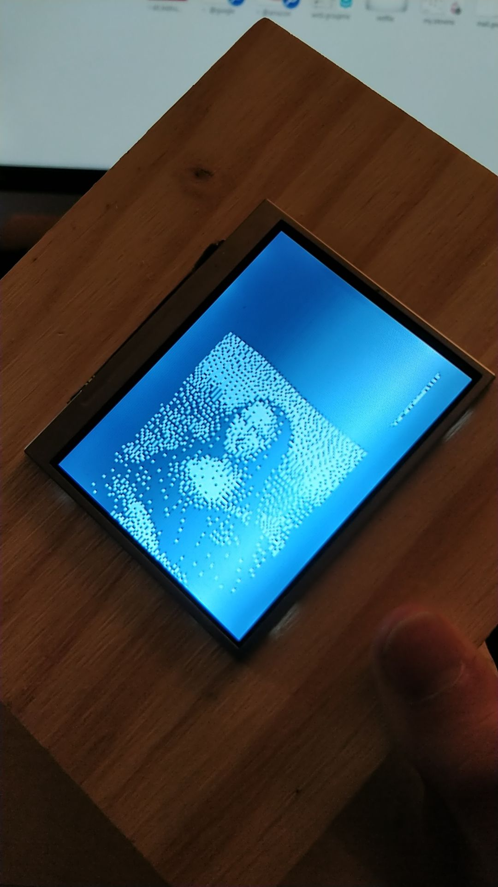
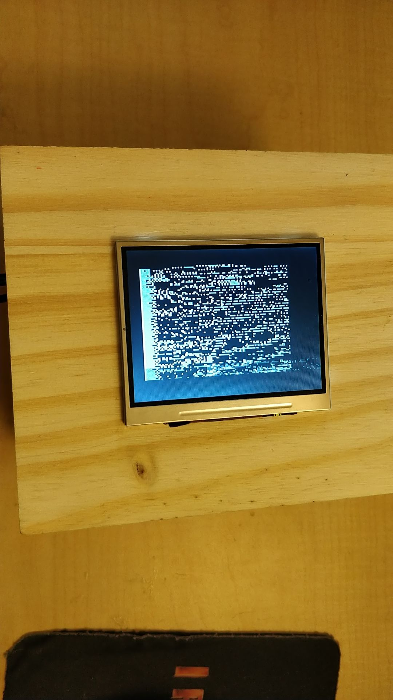

This project consists of a video display mounted on a box, with a magnetometer inside the box. I have coded it so that rotating the box in various ways directly interferes with the NTSC video signal in unpredictable ways. The code uses a customized version of the TVout library that I have modified to suit my objectives. The video screen is a cheap, $15 car camera monitor. The box is made of wood, with small press-fit dowels holding the sides together.

